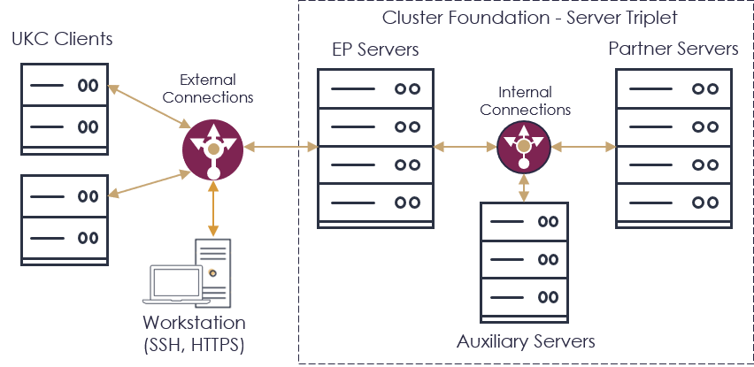

# UKC Express Deploy

Unbound Key Control (“**UKC**”) provides the advanced technology and the architecture for secure key management. An overview of the UKC solution is found [here](https://www.unboundtech.com/product/unbound-key-control/).

UKC can be rapidly deployed using one of these methods:
- [Docker](https://hub.docker.com/?overlay=onboarding) - Install UKC in a container. This method is intended for POCs. The complete system runs on a single device.
- [Terraform](https://www.terraform.io/downloads.html) - Use code to build the UKC infrastructure. This method is intended for production systems. The complete system runs on separate AWS devices.

The rapid installation process is described below. For the full installation process, refer to the [UKC User Guide](https://www.unboundtech.com/docs/UKC/UKC_User_Guide/HTML/Content/Products/UKC-EKM/UKC_User_Guide/Installation/A1.html).

Note: If you are trying to use the [CASP Express Deploy](https://github.com/unbound-tech/CASP-Express-Deploy), you cannot run it and the UKC Express Deploy at the same time.

## Overview

The  system architecture is shown in the following figure.

The UKC implementation is comprised of the following components:

1. Server Triplet
    - Entry Point ("EP") Servers
    - Partner Servers
    - Auxiliary Servers
2. UKC Clients
3. Workstation

The main part of  is the server triplet: the EP, Partner, and Auxiliary servers. The triplet stores keys and handles all key functions.
UKC Clients run the UKC command line software or use REST APIs to access the  server triplet.

The Workstation is used to manage the UKC installation.

Both deployment options install the cluster foundation (#1 above). After installation, you can log into the UKC web interface and start using UKC!

## Installation
To get started with the installation, follow the instructions based on the installation type:
- [Docker](./ukc-docker)
- [Terraform](./ukc-terraform)
